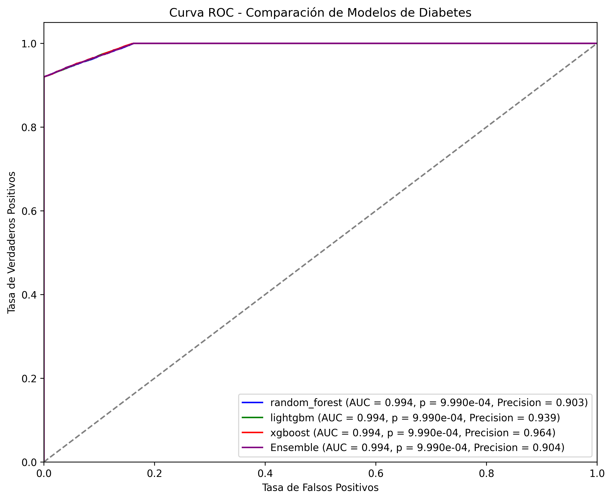
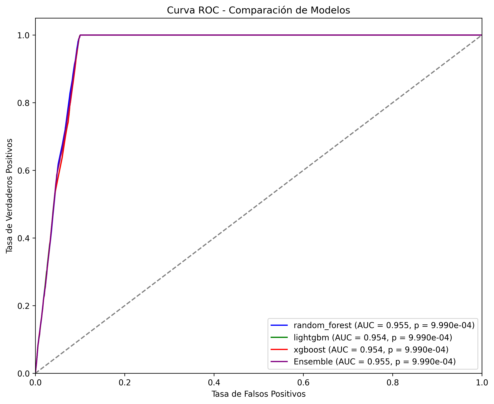
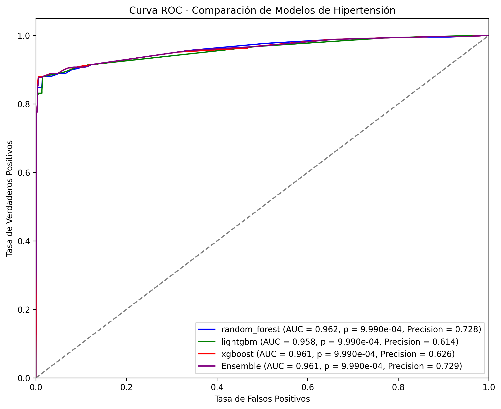

# PrevenIA Pro - Sistema de Predicción de Riesgos de Salud

PrevenIA Pro es un sistema de machine learning para la predicción de riesgos de salud, específicamente enfocado en tres condiciones principales: diabetes, obesidad e hipertensión. El sistema utiliza un conjunto de modelos de ensamble que combinan Random Forest, LightGBM y XGBoost para proporcionar predicciones precisas y robustas.

## Características Principales

- Predicción de múltiples condiciones de salud:
  - Diabetes
  - Obesidad
  - Hipertensión
- Modelos de ensamble optimizados
- Curvas ROC y métricas de evaluación
- API REST para integración
- Preprocesamiento automático de datos
- Manejo de desbalance de clases

## Estructura del Proyecto

```
ml-prevenia-pro/
├── app/
│   ├── models/           # Modelos entrenados
│   ├── services/         # Servicios de predicción
│   ├── utils/           # Utilidades y procesamiento
│   └── main.py          # Punto de entrada de la API
├── Dockerfile           # Configuración de Docker
├── requirements.txt     # Dependencias del proyecto
└── Makefile            # Comandos de automatización
```

## Curvas ROC

El sistema genera curvas ROC para cada modelo durante el entrenamiento. A continuación se muestran las curvas para cada condición:

### Diabetes



### Obesidad



### Hipertensión



Cada gráfica muestra el rendimiento de los modelos individuales (Random Forest, LightGBM, XGBoost) y el modelo de ensamble final, permitiendo comparar su capacidad de discriminación.

Las curvas ROC son una herramienta fundamental para evaluar el rendimiento de los modelos de clasificación, donde:

- El eje Y representa la Tasa de Verdaderos Positivos (Sensibilidad)
- El eje X representa la Tasa de Falsos Positivos (1 - Especificidad)
- Un área bajo la curva (AUC) más cercana a 1 indica un mejor rendimiento del modelo

## Instalación

1. Clonar el repositorio:

```bash
git clone <repository-url>
cd ml-prevenia-pro
```

2. Instalar dependencias:

```bash
pip install -r requirements.txt
```

## Uso

### Generar Dataset y Entrenar Modelos

```bash
# Generar dataset
make dataset

# Entrenar todos los modelos
make train-all

# O entrenar modelos individualmente
make train-diabetes
make train-obesity
make train-hypertension
```

### Ejecutar el Servidor

```bash
make run
```

El servidor estará disponible en `http://localhost:8000`

## Características Técnicas

### Modelos de Ensamble

Cada condición utiliza un modelo de ensamble que combina:

- Random Forest (RF)
- LightGBM (LGBM)
- XGBoost (XGB)

Los pesos del ensamble se optimizan automáticamente basados en el rendimiento individual de cada modelo.

### Preprocesamiento de Datos

- Codificación de variables categóricas
- Discretización de variables numéricas
- Escalado de características
- Manejo de valores faltantes
- Balance de clases usando SMOTE

### Métricas de Evaluación

- ROC AUC Score
- Precisión
- Recall
- F1-Score
- Matriz de Confusión

## Desarrollo

### Requisitos de Desarrollo

- Python 3.8+
- scikit-learn
- LightGBM
- XGBoost
- FastAPI
- pandas
- numpy

### Comandos Útiles

```bash
# Limpiar archivos generados
make clean

# Ejecutar en modo desarrollo
make run
```

## Contribuir

1. Fork el repositorio
2. Crear una rama para tu feature (`git checkout -b feature/AmazingFeature`)
3. Commit tus cambios (`git commit -m 'Add some AmazingFeature'`)
4. Push a la rama (`git push origin feature/AmazingFeature`)
5. Abrir un Pull Request

## Licencia

Este proyecto está licenciado bajo la Licencia MIT - ver el archivo `LICENSE` para más detalles.
